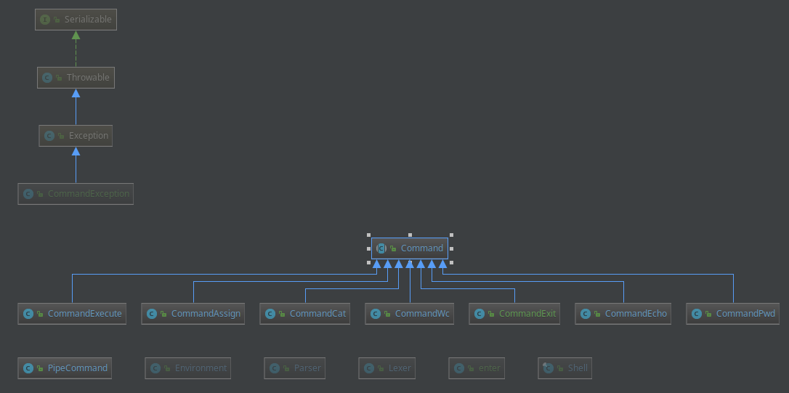

# AU_software_design

Структура проекта:
**Shell** - запускает CLI.

**Lexer** - принимает на вход строку и разбивает на лексемы.

**Parser** - преобразует список лексем в цепочку комманд.

**Environment** - содержит переменные окружения.

**Command** - интерфейс команд, который наследуют реализованные команды:
wc, cat, echo, pwd, exit

##### Диаграмма классов

### Поддерживаемые команды (из требований)

1. cat [FILE] — вывести на экран содержимое файла
2. echo — вывести на экран свой аргумент (или аргументы)
3. wc [FILE] — вывести количество строк, слов и байт в файле
4. pwd — распечатать текущую директорию
5. exit — выйти из интерпретатора
6. grep - поиск по регулярному выражению
7. имя=значение

Функциональность:

* Одинарные и двойные кавычки
* Окружение (набор переменных)
* Оператор $ (подстановка переменной)
* Пайплайны (перенаправление ввода-вывода)